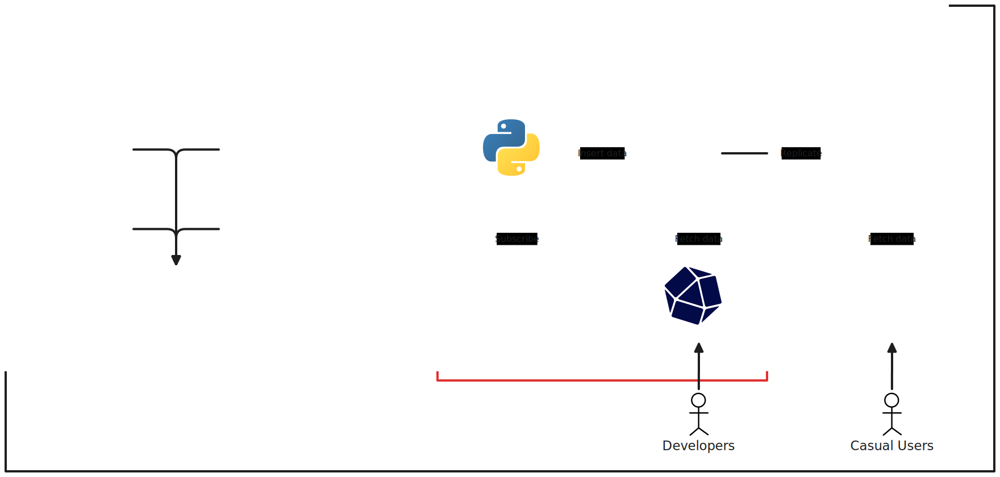

# Swinburne Weather Service (codename: ZimmerWetter)

This university project is about developing and deploying an IoT Weather Station system within the campus of Swinburne University@HCMC, providing a weather service for students, lecturers, staffs, and visitors of the campus.

This is Minh Triet's first student project at Swinburne University.

## How to deploy this? / Manual

### Raspberry Pi Component

1. Prepare a Raspberry Pi 3+ with a static IP address, Git, and Docker Compose
2. Clone this repository
3. Create the file `pwfile` in `config/mosquitto` with 0700 permission
4. Create the file `.env` by copying `.env.example`
5. Enter required information into `.env`
6. In the terminal working at the repository's directory, run `docker compose up -d`

### Weather Station Component

1. Clone this repository
2. Open the `esp32` directory using either **Arduino IDE** or **VSCode with Arduino extension**
3. Copy the file `secrets.template.h` and name it `secrets.h`
4. Enter required information into the `secrets.h` file
5. Connect an ESP32 to your device
6. Flash the Arduino sketch into the ESP32

## What does it measure?

- Temperature (ºC)
- Humidity (%)
- Atmospheric pressure (Pa)
- Rainfall (mm)
- Wind speed (m/s)
- Wind direction (º)

## What technologies are used? / Tech stack

## Who is involved? / Credits

- Author: **Nguyen Ta Minh Triet**, K5 @ Swinburne University, HCMC, Vietnam
- Co-author: **Nguyen Khanh Phuc Thinh**, K4 @ Swinburne University, HCMC, Vietnam
- Member: **Tong Duc Tu Tam**, K5 @ Swinburne University, HCMC, Vietnam
- Member: **Nguyen Nhat Minh**, K4 @ Swinburne University, HCMC, Vietnam
- Member: **Huynh Nguyen Quoc Bao**, K3 @ Swinburne University, HCMC, Vietnam
- Mentor: **Dr. Pham Van Dai**, Lecturer @ Swinburne University, Hanoi, Vietnam
- Manager: **Ms. Titan Vo** @ Swinburne University Academic Department, HCMC, VIetnam
