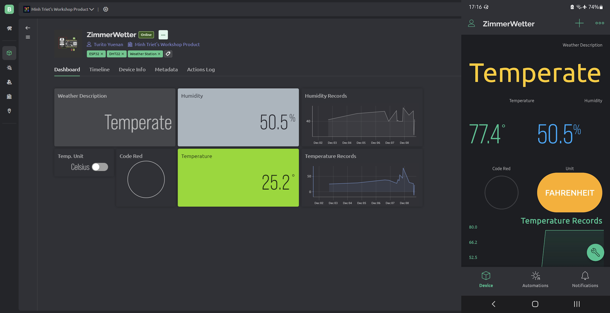
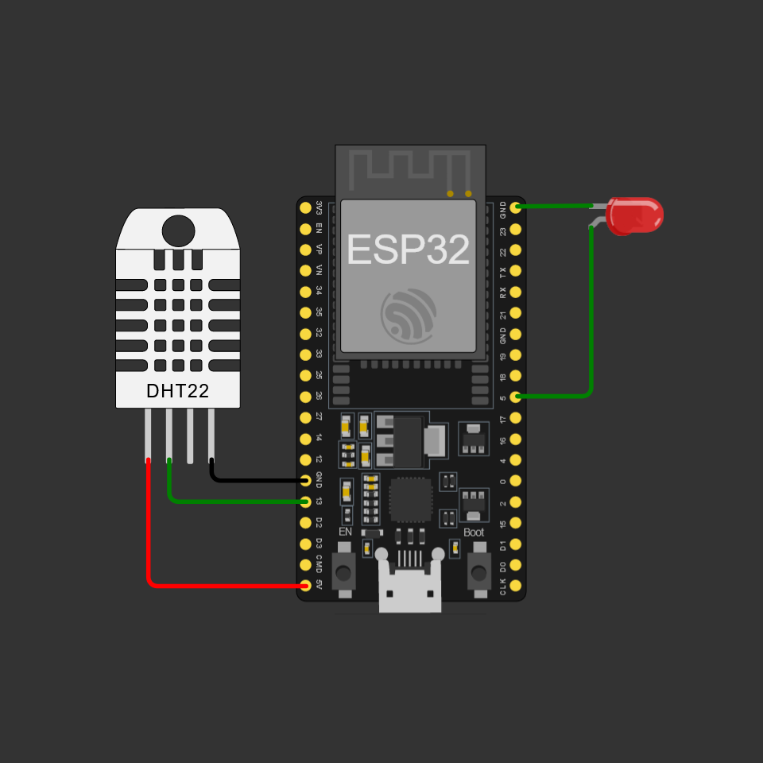

# ZimmerWetter - Demand Your Weather Back!

> This is a university workshop project

ZimmerWetter (German for "Room Weather") is an IoT project for setting up a weather station of your own. With simple components, you'll be able to know the specific weather of your own home/workplace without the need of an external weather provider!

## Usage

- Within [Blynk](https://blynk.cloud), setup a new device.
- Copy `settings.example.h` and rename the copied file as `settings.h`
- Configure the settings to your preferences
- Load the files `sketch.ino`, `settings.h`, `libraries.txt` and `diagram.json` to a Wokwi project
- To use in-real-life, connect an ESP32 board wired to a DHT22 sensor and an LED, then run the file `sketch.ino` in Arduino IDE/CLI.

## Tech stack

- Frontend: Blynk
- Simulation: Wokwi
- Libraries: See [the library file](libraries.txt)
- Hardware: ESP32 microcontroller, DHT22 sensor, LEDs & wires

## Gallery

### User Interface

### Hardware

