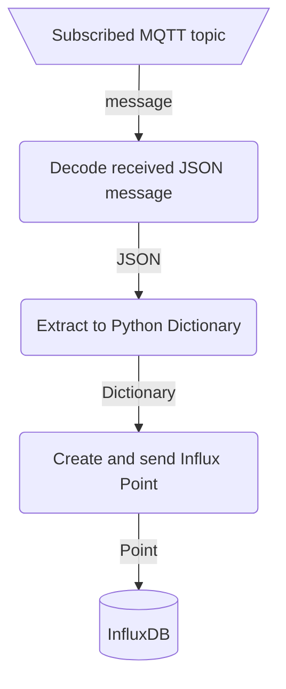

# MQTT-to-InfluxDB ETL Pipeline

This Python script creates an ETL pipeline transferring weather data from the edge device's MQTT broker to the local InfluxDB database

```mermaid
flowchart TD
	s1[\Subscribed MQTT topic/]
	-->|message| s2(Decode received JSON message)
	-->|JSON| s3(Extract to Python Dictionary)
	-->|Dictionary| s4(Create and send Influx Point)
	-->|Point| s5[(InfluxDB)]
```
