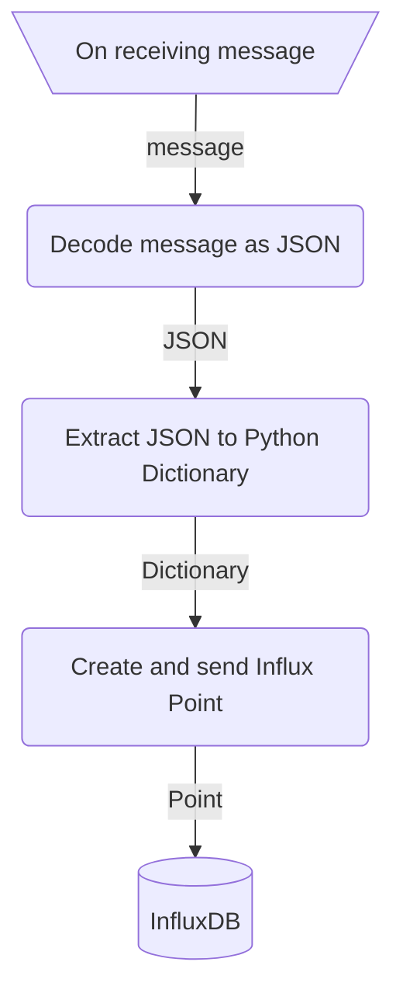

# Python Script for MQTT Broker

## Process



## Prerequisites

- Raspberry Pi 3+ (optional)
- Eclipse Mosquitto
- InfluxDB 2+
- Python 3+

## Usage

```sh
# Inside the directory, create a virtual environment for Python
python -m venv .venv

# Enter the virtual environment
source .venv/bin/activate

# Install packages required for the script
pip install -r requirement.txt

# Configure influx.ini file with your own database token
cp influx.example.ini influx.ini
nano influx.ini

# Run the Python script (Debian command)
python3 main.py
```
